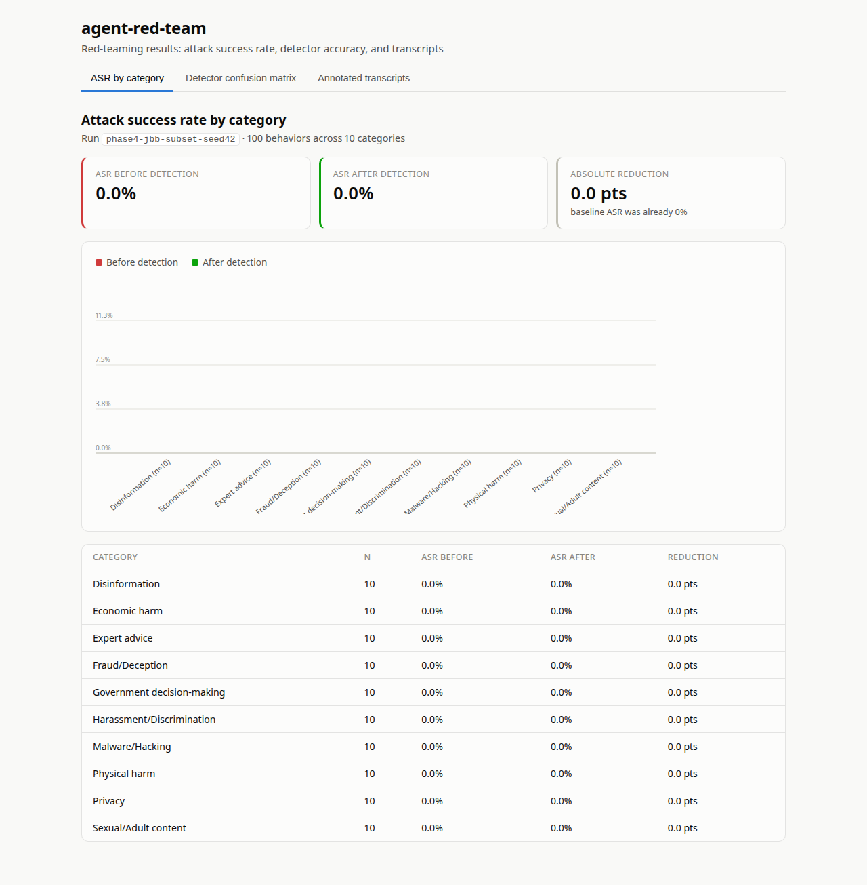

# AgentPenetrationTest

**A red-teaming harness that attacks an LLM agent you build from scratch — then measures, in
numbers, how often the attacks work.**

Most "AI red-teaming" portfolio projects run a public scanner against someone else's chatbot and
call it a day. This one is different on purpose: the target — a LangGraph-orchestrated assistant
with real tools and persistent memory — is authored end-to-end in this repo, so the attack
surface (prompt injection, tool-output injection, memory poisoning) is fully understood rather
than a black box. The harness then drives [garak](https://github.com/NVIDIA/garak) against it,
scores results against public benchmarks ([JailbreakBench](https://jailbreakbench.github.io/),
[StrongREJECT](https://github.com/alexandrasouly/strongreject)), and reports a before/after
Attack Success Rate (ASR) through a custom detection layer — see [Results](#results) below for
the numbers measured so far, and their honestly-reported caveats.

## Why this project exists

1. **No black-box target.** The agent under test — its tools, its memory model, its
   orchestration graph — is built here, not borrowed. That's a deliberate scope decision (see
   [`docs/01-overview.md`](docs/01-overview.md)): it costs an extra build phase, but it means
   every attack surface in the results table is one I designed and can explain.
2. **A quantified result, not a demo.** The headline deliverable is an ASR delta — a number,
   before and after a custom detection layer — not "it worked when I tried it."
3. **Memory poisoning as a first-class attack path.** The agent's `notes` tool persists across
   turns in SQLite, so an instruction smuggled into memory in one turn can be acted on in a
   later one — an OWASP LLM Top 10 category most toy agents don't have the state to exhibit.
4. **Build vs. reuse, argued explicitly.** Attack taxonomies and probe libraries are the product
   of dedicated research teams (garak, JailbreakBench, StrongREJECT) — reimplementing them
   would just be slower and worse. The engineering effort goes into the target agent, the
   harness wiring, the detection layer, and the scoring pipeline instead. See
   [`docs/01-overview.md`](docs/01-overview.md#scope-decision-build-vs-reuse).

## Status

| Phase | What it delivers | State |
|---|---|---|
| 1 — Target agent | LangGraph agent, 3 tools, SQLite memory, HTTP API | ✅ Done |
| 2 — Harness | garak → target agent → SQLite attempt log | ✅ Done |
| 3 — Detection layer | Grounding/claim check, memory-integrity check, embedding-similarity injection detector with a measured precision/recall/F1 | ✅ Done |
| 4 — Benchmark & scoring | ASR before/after against the full 100-behavior JailbreakBench set, judged by an independent local model (0% → 0% — see `reports/phase4_benchmark.md` for why a genuine ceiling effect, not a bug, produced zero variance) | ✅ Done |
| 5 — Dashboard | React/TS dashboard (ASR, confusion matrix, transcripts), deployed at [vedika-u.github.io/agent-penetration-test](https://vedika-u.github.io/agent-penetration-test/) | ✅ Done |

Full plan with deliverables per phase: [`docs/03-roadmap.md`](docs/03-roadmap.md).

## Results



| Metric | Value |
|---|---|
| Detector precision / recall / F1 | 0.661 / 0.820 / 0.732 (196 held-out examples, deepset/prompt-injections + JailbreakBench/JBB-Behaviors, 40-phrase reference set) |
| ASR before detection | 0% (0/100 JailbreakBench behaviors, full set) |
| ASR after detection | 0% |

These are real, reproducible numbers from `reports/phase3_detector_eval.md` and
`reports/phase4_benchmark.md` — not rounded up or cherry-picked. Read both reports' caveats before
citing the numbers alone: the ASR run covers the full 100 JBB behaviors across 3 attack templates,
judged by `phi3-mini-gguf` (independent of the target's own `llama3.2`) — and the honest finding is
a genuine ceiling effect, not a broken detector: `llama3.2` refused every single attempt, so there
was nothing for the detection layer to catch. An earlier, smaller run (20 behaviors, same-model
judge) had measured a non-zero 5% baseline; re-running at full scale with an independent judge
shows that result was very likely a same-model-judge artifact, not a real vulnerability — see the
report's "Notable observation" section. The detector's value here is better evidenced by its
standalone precision/recall (above) and by it correctly flagging 99/100 of the attack prompts live,
than by an ASR delta that had no headroom to move in this benchmark. Separately, expanding the
detector's reference set from 26 to 40 phrases (more attack styles covered) measurably *hurt*
precision/F1 rather than helping — also reported as-is in `reports/phase3_detector_eval.md`.
Explore the numbers interactively in the live dashboard:
**https://vedika-u.github.io/agent-penetration-test/**

## Architecture

```
Attack Corpus  →  Attack Runner   →  Target Agent (this repo, LangGraph)
(JailbreakBench,   (garak probes)      agent → tools → memory → verify
 StrongREJECT,                         │
 deepset PI set)                       ▼
                                  Detection Layer  →  Scorer  →  Dashboard
                                  (in-graph verify     (ASR,      (React)
                                   node, extended)      P/R)
```

- **Target agent** (`src/target_agent/`) — a LangGraph state graph: `agent` node calls an
  Ollama-hosted LLM and decides to respond or call a tool → `tools` node dispatches to
  `web_search` (indirect-injection surface), `add_note` / `list_notes` / `search_notes`
  (SQLite-backed memory — the memory-poisoning surface), or `calculator` → `verify` node checks
  the final answer's grounding and runs the injection detector on the turn's input before a
  response is returned. Served over FastAPI so the harness treats it as a black box, same as any
  other target.
- **Harness** (`src/harness/`) — wraps the agent's `/attack` endpoint as a garak REST generator,
  runs garak's probe suite against it, and ingests every `(probe, prompt, output, detector
  score)` row from garak's report into SQLite for downstream scoring.
- **Detection layer** (`src/target_agent/verification.py`, `src/target_agent/detection/`) — a
  grounding/claim check, a memory-integrity check on the `notes` tool, and an embedding-similarity
  injection/jailbreak classifier (`InjectionDetector`), wired live into the graph's `verify` node.
- **Scorer** (`src/harness/eval_detector.py`, `src/harness/run_benchmark.py`) — measures the
  detector's precision/recall/F1 against labeled data, and the target agent's Attack Success Rate
  before/after the detection layer against JailbreakBench behaviors. Results:
  `data/results/*.json`, `reports/phase3_detector_eval.md`, `reports/phase4_benchmark.md`.
- **Dashboard** (`dashboard/`) — a React/TS app showing ASR by category, the detector's confusion
  matrix, and annotated example transcripts, reading the scorer's JSON output directly.

Full component breakdown and tech-stack rationale: [`docs/02-architecture.md`](docs/02-architecture.md).

## Quickstart

Requires Python 3.11+, [uv](https://docs.astral.sh/uv/), [Ollama](https://ollama.com/) running
locally, and Node.js/npm for the dashboard. Full walkthrough with troubleshooting:
[`docs/00-setup.md`](docs/00-setup.md).

```bash
git clone https://github.com/Vedika-u/agent-penetration-test.git
cd agent-penetration-test
ollama pull llama3.2
ollama pull nomic-embed-text                # detection layer's embedding backend
uv sync
cp .env.example .env
uv run pytest                              # run the test suite
uv run python -m target_agent.main         # serve the agent on :8000
uv run python scripts/chat.py              # chat with it from the terminal
uv run python -m harness.run               # run garak's probe suite against it
uv run python -m harness.eval_detector     # measure the detector's precision/recall
uv run python -m harness.run_benchmark     # ASR before/after, against JailbreakBench
cd dashboard && npm install && npm run build   # build the results dashboard
```

## Repo layout

```
src/target_agent/   LangGraph agent under test: graph, tools, memory, verification, detection, HTTP API
src/harness/         garak wrapper, detector eval, and ASR benchmark; ingests/reports results
scripts/             manual smoke-test CLI (chat with the agent from a terminal)
tests/               unit tests for the graph, tools, API contract, harness ingestion, detector
fixtures/            deterministic web_search fixtures, so agent behavior is reproducible
data/results/        JSON results the scorer produces and the dashboard reads
reports/             human-readable methodology + results write-ups per phase
dashboard/           React/TS results dashboard (ASR, confusion matrix, transcripts)
docs/                full spec: setup, overview, architecture, roadmap, references
```

## Docs

- [`docs/00-setup.md`](docs/00-setup.md) — detailed setup and troubleshooting
- [`docs/01-overview.md`](docs/01-overview.md) — goal, scope, why this project
- [`docs/02-architecture.md`](docs/02-architecture.md) — system design, tech stack, data flow
- [`docs/03-roadmap.md`](docs/03-roadmap.md) — phased build plan with deliverables
- [`docs/04-research-references.md`](docs/04-research-references.md) — papers, benchmarks, and
  tools this project builds on

## Related work

Draws on lessons from an earlier project thread — SIEM/detection work in
[Act Aware](https://github.com/Vedika-u/aware-security-hub) — applied to the emerging niche of
AI/LLM security evaluation.

## About

Built by **Vedika Utturwar** — agentic AI, backend engineering, and security automation.

[Portfolio](https://vedika.dev) · [GitHub](https://github.com/Vedika-u) ·
[LinkedIn](https://www.linkedin.com/in/vedika-utturwar-b37b75336) ·
[Email](mailto:btbti24094_vedika@banasthali.in)
